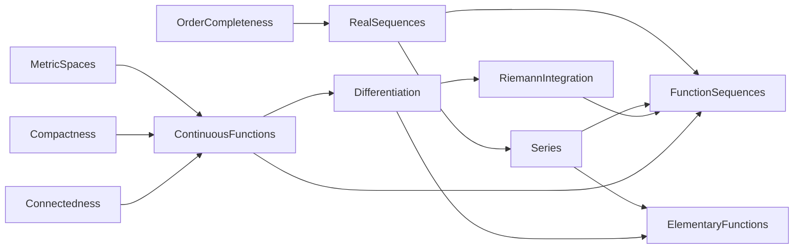

# Analysis

## Scope

These sheets develop a first course in real analysis: completeness, numerical sequences
and series, continuity, one-variable differentiation and integration, uniform convergence, and
elementary functions. The treatment uses Mathlib's analytic vocabulary while keeping the central
arguments recognizably mathematical. General point-set topology lives in the neighbouring
`Topology` area.

## References

- Walter Rudin, *Principles of Mathematical Analysis*, 3rd ed.
- Rui Wang, *Lecture Notes for Math 104 — Introduction to Analysis*.
- MIT 18.100B/18.100C real-analysis materials.

## Corresponding Mathlib part

`Mathlib.Analysis.*`, `Mathlib.Topology.Sequences`,
`Mathlib.Topology.Algebra.InfiniteSum.*`, and the real special-function modules.

## Dependency graph

