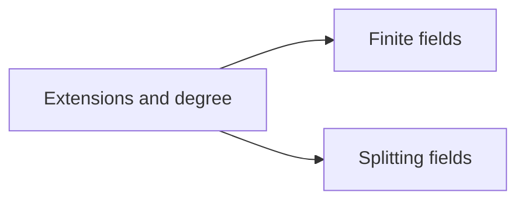

# Field theory

## Scope

These sheets cover finite field extensions, finite fields, and splitting fields.  They stop before
the Galois correspondence and the broader theory of separability and normality.

## References

Dummit & Foote, *Abstract Algebra*, Chapter 13; Artin, *Algebra*, Chapters 13–15; Stewart,
*Galois Theory*, Chapters 4–9.

## Corresponding Mathlib part

`Mathlib.FieldTheory.Tower`, `Mathlib.FieldTheory.Minpoly`, `Mathlib.FieldTheory.Finite`, and
`Mathlib.FieldTheory.SplittingField`.

## Dependency graph

