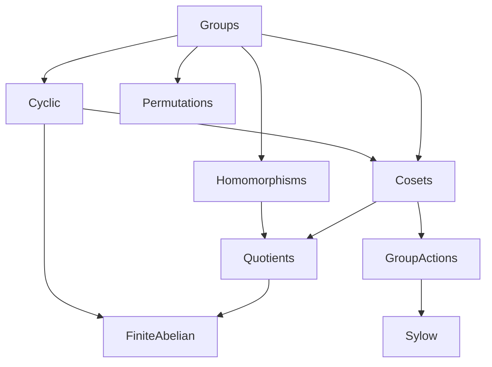

# Group Theory — exercises overview

Exercises on groups, formalized in Lean 4 + Mathlib. Each sheet is a topic file under this
folder; prove the statements yourself, then compare with `Solutions/GroupTheory/`.

## Scope

The groups part of a first course in abstract algebra: the axioms and what they force
(uniqueness, cancellation, inverses), subgroups and their lattice, cyclic groups, permutations
and sign, cosets and Lagrange, homomorphisms and the isomorphism theorems, group actions
(orbit–stabilizer, the class equation, Cauchy), and the two classification capstones — Sylow's
theorems and the structure of finite abelian groups.

## References

- Joseph Gallian, *Contemporary Abstract Algebra*.
- John Fraleigh, *A First Course in Abstract Algebra*.
- Thomas Judson, *Abstract Algebra: Theory and Applications*.
- Michael Artin, *Algebra*, Ch. 2, 6, 7.

## Corresponding Mathlib part

`Mathlib.Algebra.Group.*` (axioms, subgroups, homomorphisms, opposite),
`Mathlib.GroupTheory.*` (`OrderOfElement`, `Perm`, `Coset`, `QuotientGroup`, `GroupAction`,
`PGroup`, `Sylow`, `FiniteAbelian`, `SpecificGroups`).

## Sheet dependency graph

Edge `A --> B` means **B builds on A** (B uses results/notions from A).

