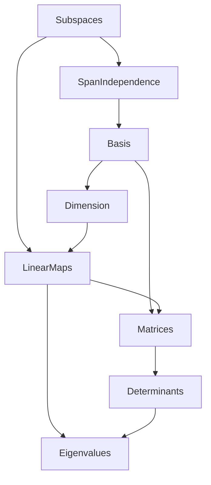

# Linear Algebra — exercises overview

Exercises on linear algebra over a field, formalized in Lean 4 + Mathlib. Each sheet is a
topic file under this folder; prove the statements yourself, then compare with
`Solutions/LinearAlgebra/`.

## Scope

The abstract theory of vector spaces and linear maps: subspaces and their lattice, spans
and linear independence, bases, dimension, linear maps and rank, matrices, determinants,
and eigenvalues. Concrete matrix computation appears only as a tool; the emphasis is
conceptual. Inner product spaces / orthogonality are **not** here — they live under
`Analysis` in Mathlib and will get their own area.

## References

- Sheldon Axler, *Linear Algebra Done Right* (4e).
- Sergei Treil, *Linear Algebra Done Wrong*.
- John M. Erdman, *Exercises and Problems in Linear Algebra*.

## Corresponding Mathlib part

`Mathlib.Algebra.Module.Submodule.*` (subspaces and their lattice) and
`Mathlib.LinearAlgebra.*` (span, basis, dimension/`finrank`, `LinearMap`, `Matrix.toLin`,
`Matrix.det`, eigenvalues).

## Sheet dependency graph

Edge `A --> B` means **B builds on A** (B uses results/notions from A).

