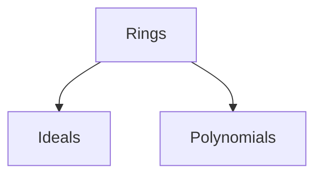

# Ring Theory — exercises overview

## Scope

These sheets develop the commutative-ring portion of a first abstract-algebra course: rings,
domains and fields; ideals and quotients; polynomial arithmetic; factorization; and Gaussian
integers.

## References

Gallian, *Contemporary Abstract Algebra*; Artin, *Algebra*, Ch. 11–12; Judson, *Abstract Algebra*.

## Corresponding Mathlib part

`Mathlib.Algebra.Ring.*`, `Mathlib.RingTheory.*`, and `Mathlib.NumberTheory.Zsqrtd.*`.

## Sheet dependency graph

