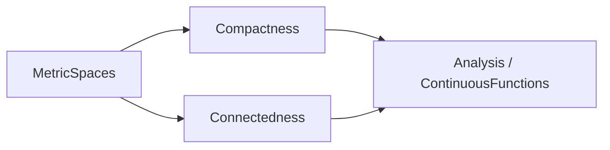

# Topology

## Scope

These sheets introduce metric and general topological ideas needed throughout a first analysis
course: open sets, continuity, compactness, local compactness, and connectedness. Metric examples
ground the definitions, while the connectedness sheet also works in arbitrary topological spaces.
Algebraic topology is outside the course scope.

## References

- Walter Rudin, *Principles of Mathematical Analysis*, 3rd ed.
- Rui Wang, *Lecture Notes for Math 104 — Introduction to Analysis*.
- MIT 18.100B real-analysis materials.

## Corresponding Mathlib part

`Mathlib.Topology.Basic`, `Mathlib.Topology.MetricSpace.*`,
`Mathlib.Topology.Compactness.*`, and `Mathlib.Topology.Connected.*`.

## Dependency graph

